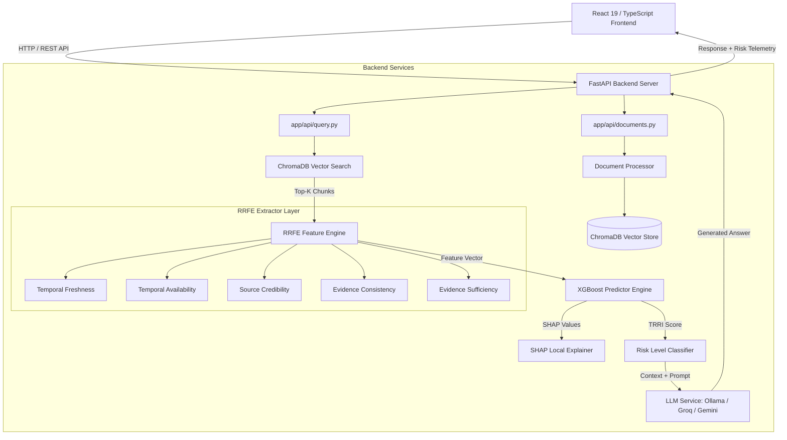
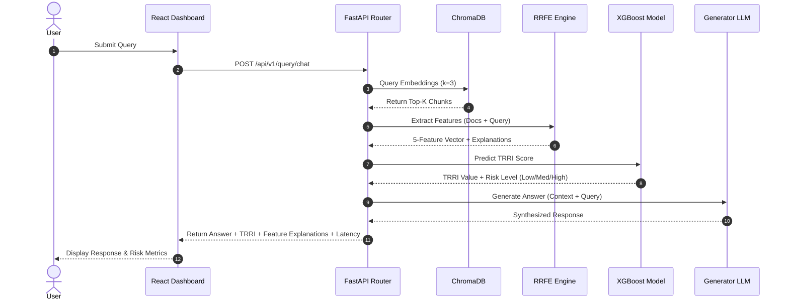
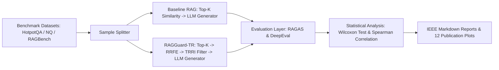

# RAGGuard-TR: Temporal-Aware Risk and Reliability Index for Retrieval-Augmented Generation

[](https://python.org)
[](https://fastapi.tiangolo.com)
[](https://react.dev)
[](https://vitejs.dev)
[](https://chromadb.ai)
[](https://xgboost.readthedocs.io)

RAGGuard-TR is an open-source framework for pre-generation retrieval reliability assessment and hallucination risk estimation in Retrieval-Augmented Generation (RAG) systems. By evaluating temporal freshness, availability, source credibility, evidence consistency, and sufficiency before generation, RAGGuard-TR computes a Temporal-Aware Risk and Reliability Index (TRRI) to quantify context quality prior to query response synthesis.

---

## Table of Contents

- [Overview](#overview)
- [Quick Start](#quick-start)
- [Motivation](#motivation)
- [Problem Statement](#problem-statement)
- [Research Contribution](#research-contribution)
- [Framework Overview](#framework-overview)
- [Implemented Features](#implemented-features)
- [Research Components](#research-components)
- [System Architecture](#system-architecture)
- [End-to-End Pipeline](#end-to-end-pipeline)
- [Repository Structure](#repository-structure)
- [Installation](#installation)
- [Configuration](#configuration)
- [Usage](#usage)
- [Technical Stack](#technical-stack)
- [Design Principles](#design-principles)
- [Core Components](#core-components)
- [Experimental Design](#experimental-design)
- [Benchmark Baselines](#benchmark-baselines)
- [Evaluation](#evaluation)
- [Results](#results)
- [Reproducibility](#reproducibility)
- [Limitations](#limitations)
- [Future Research Directions](#future-research-directions)
- [Contributing](#contributing)
- [License](#license)
- [Authors](#authors)
- [Citation](#citation)
- [Acknowledgements](#acknowledgements)

---

## Overview

Retrieval-Augmented Generation (RAG) combines dense vector retrieval with Large Language Models (LLMs) to answer queries using external knowledge bases. However, standard RAG architectures operate under the assumption that top-K retrieved document chunks are accurate, relevant, temporally current, and non-contradictory. When knowledge bases contain outdated documents, missing timestamps, low-credibility sources, or mutually exclusive claims, LLMs frequently synthesize plausible yet unfaithful or hallucinated responses.

RAGGuard-TR introduces a pre-generation reliability filter and feature-based risk predictor. The system extracts a 5-dimensional feature vector via the Risk and Reliability Feature Extractor (RRFE) and predicts the Temporal-Aware Risk and Reliability Index (TRRI) using a trained gradient-boosted regression model (XGBoost) prior to sending context to the generator LLM.

---

## Quick Start

### 1. Clone Repository & Setup Environment

```powershell
git clone https://github.com/your-org/ragguard-tr.git
cd ragguard-tr

# Create backend virtual environment
cd backend
python -m venv venv
.\venv\Scripts\Activate.ps1

# Install runtime dependencies
pip install -r requirements-runtime.txt
```

### 2. Configure Environment Variables

Create `backend/.env` (or copy from `.env.example`):

```env
OLLAMA_HOST=http://localhost:11434
CHROMA_HOST=localhost
CHROMA_PORT=8000
GENERATOR_LLM_MODEL=qwen2.5:latest
EMBEDDING_MODEL=nomic-embed-text
EVALUATOR_PROVIDER=groq
EVALUATOR_LLM_MODEL=llama-3.3-70b-versatile
GROQ_API_KEY=your_groq_api_key_here
```

### 3. Launch Backend API

```powershell
# From backend directory
python -m uvicorn app.main:app --port 8080 --reload
```

Verify backend health at `http://localhost:8080/health`.

### 4. Install & Launch Frontend Dashboard

In a separate terminal:

```powershell
cd frontend
npm install
npm run dev
```

Open dashboard at `http://localhost:5173`.

### 5. Example API Query

```powershell
Invoke-RestMethod -Uri "http://localhost:8080/api/v1/query/chat" `
  -Method POST `
  -ContentType "application/json" `
  -Body '{"query": "What are the recent advancements in solar cell efficiency?"}'
```

---

## Motivation

Standard vector search algorithms (e.g., HNSW, Cosine Similarity) retrieve document chunks based strictly on high-dimensional semantic similarity to the query embedding. Vector similarity does not account for temporal validity, factual updates, source authority, or internal evidence conflicts:

1. **Temporal Degradation**: A high-similarity retrieved chunk from 2018 may be factually superseded by a lower-similarity chunk from 2024.
2. **Missing Metadata**: Many retrieved documents lack explicit timestamp annotations, leaving LLMs unaware of chronological precedence.
3. **Evidence Collision**: Two retrieved passages with equal similarity scores may contain contradictory factual claims (e.g., conflicting statistics).
4. **Source Irrelevance**: Vector distance metrics treat unverified blog posts and peer-reviewed journals equally if their lexical context matches.

Evaluating context quality *before* generation enables RAG frameworks to quantify hallucination risk and provide transparent reliability scores alongside generated answers.

---

## Problem Statement

Given a user query $q$ and a corporate or academic corpus $\mathcal{D}$, a standard retriever selects a subset of $K$ document chunks $C = \{c_1, c_2, \dots, c_K\} \subset \mathcal{D}$ maximizing embedding cosine similarity:

$$S_{\text{sim}}(q, c_i) = \frac{\mathbf{e}_q \cdot \mathbf{e}_{c_i}}{\|\mathbf{e}_q\| \|\mathbf{e}_{c_i}\|}$$

However, the conditionally generated response $\hat{y} \sim P_{\text{LLM}}(y \mid q, C)$ exhibits high hallucination risk when:

$$\exists \, c_i, c_j \in C \quad \text{such that} \quad \text{Conflict}(c_i, c_j) = \text{True} \quad \lor \quad \text{Age}(c_i) \gg \tau_{\text{threshold}}$$

The objective of RAGGuard-TR is to formulate a pre-generation mapping $\Phi(q, C) \to \text{TRRI} \in [0.0, 1.0]$, estimating the probability that $C$ is sufficient, consistent, credible, and temporally current enough to support faithful generation without hallucination.

---

## Research Contribution

RAGGuard-TR formalizes a modular, temporal-aware framework for pre-generation reliability estimation.

| Aspect | Conventional RAG | RAGGuard-TR |
|---|---|---|
| **Retrieval Filtering** | Top-$K$ Cosine Similarity | Top-$K$ Similarity + 5-Feature RRFE Scoring |
| **Temporal Awareness** | None (Ignores document age) | Explict Freshness Decay & Availability Extraction |
| **Conflict Analysis** | Blind concatenation | Semantic & N-Gram Evidence Consistency Verification |
| **Credibility Scoring** | Uniform source weight | Metadata Domain Authority Weighting |
| **Risk Estimation** | Post-hoc / None | Pre-Generation XGBoost TRRI Regression |
| **Explainability** | Black-box LLM generation | Per-feature confidence scores + SHAP importance cards |

---

## Framework Overview

RAGGuard-TR decouples context reliability analysis into two layers:

1. **Risk and Reliability Feature Extractor (RRFE)**: Calculates five normalized sub-scores $\mathbf{f} = [f_{\text{fresh}}, f_{\text{avail}}, f_{\text{cred}}, f_{\text{cons}}, f_{\text{suff}}] \in [0, 1]^5$ accompanied by human-readable explanations and confidence scores.
2. **TRRI Predictor Engine**: An XGBoost regressor trained on benchmark contexts paired with LLM-evaluated target reliability labels ($RRT$), outputting the scalar TRRI score and local SHAP feature attributions.

---

## Implemented Features

| Module | Feature | Implementation Status | Verified Path |
|---|---|---|---|
| **RRFE Engine** | Temporal Freshness Extractor | Implemented | `app/services/rrfe/extractors/temporal_freshness.py` |
| **RRFE Engine** | Temporal Availability Extractor | Implemented | `app/services/rrfe/extractors/temporal_availability.py` |
| **RRFE Engine** | Source Credibility Extractor | Implemented | `app/services/rrfe/extractors/source_credibility.py` |
| **RRFE Engine** | Evidence Consistency Extractor | Implemented | `app/services/rrfe/extractors/evidence_consistency.py` |
| **RRFE Engine** | Evidence Sufficiency Extractor | Implemented | `app/services/rrfe/extractors/evidence_sufficiency.py` |
| **Predictor** | XGBoost TRRI Regression | Implemented | `app/services/predictor/inference.py` |
| **Predictor** | Optuna HPO Trainer | Implemented | `app/services/predictor/train.py` |
| **Predictor** | SHAP Local Feature Explainability | Implemented | `app/services/predictor/explainability.py` |
| **API** | Real-time Query & Risk Pipeline | Implemented | `app/api/query.py` |
| **API** | Document Management & Vector Storage | Implemented | `app/api/documents.py` |
| **Dataset Construction**| Automated Dataset Pipeline | Implemented | `app/services/dataset_construction/pipeline.py` |
| **Evaluation** | IEEE Benchmark Orchestrator | Implemented | `ieee_validation_orchestrator.py` |
| **Evaluation** | Comparative RAGAS & DeepEval Runner | Implemented | `evaluation/benchmark_runner.py` |
| **Frontend** | React Dashboard & Query Visualizer | Implemented | `frontend/src/pages/Query.tsx` |

---

## Research Components

### 1. Risk and Reliability Feature Extractor (RRFE)

The RRFE engine calculates five normalized evidence reliability features:

- **Temporal Freshness ($f_{\text{fresh}}$)**: Evaluates chronological document decay using exponential time decay function relative to current reference timestamp.
- **Temporal Availability ($f_{\text{avail}}$)**: Classifies timestamp presence into `Available` ($1.0$), `Estimated` ($0.5$), or `Unknown` ($0.0$).
- **Source Credibility ($f_{\text{cred}}$)**: Domain-weighted reliability scoring based on document metadata classification (Academic = $0.95$, Official Documentation = $0.85$, General Web = $0.40$).
- **Evidence Consistency ($f_{\text{cons}}$)**: Measures semantic similarity variance and pairwise claim contradictions across retrieved passages.
- **Evidence Sufficiency ($f_{\text{suff}}$)**: Calculates context token coverage and semantic intent alignment against the query.

### 2. Scientific Integrity Enforcement

The predictor strictly rejects incomplete feature vectors: if any feature score is `None` (unavailable due to missing metadata), TRRI prediction returns `None` with risk status `"unavailable"` rather than substituting arbitrary neutral values ($0.5$).

---

## System Architecture



---

## End-to-End Pipeline



---

## Repository Structure

```
fyp/
├── backend/
│   ├── app/
│   │   ├── api/                  # FastAPI router endpoints (auth, documents, query, stats)
│   │   ├── core/                 # App configuration, database sessions, LLM clients, parsers
│   │   │   ├── clients/          # Groq, Ollama, and LangChain adapters
│   │   │   └── evaluator_provider/# Provider abstractions for evaluation LLMs
│   │   ├── db/                   # SQLAlchemy models and database setup
│   │   ├── services/
│   │   │   ├── document_processor.py # PDF/Document text extraction and splitting
│   │   │   ├── embedding_engine.py   # Embedding generation wrappers
│   │   │   ├── vector_store.py       # ChromaDB client initialization and search
│   │   │   ├── llm_service.py        # Answer generation orchestration
│   │   │   ├── rrfe/                 # ⭐ Risk and Reliability Feature Extractor engine & extractors
│   │   │   ├── predictor/            # ⭐ XGBoost TRRI inference engine, trainer, & SHAP explainer
│   │   │   ├── dataset_construction/ # Automated multi-dataset construction pipeline
│   │   │   └── dataset_generator/    # Session dataset exporter and validator
│   ├── evaluation/               # ⭐ Scientific Evaluation Benchmark Framework
│   │   ├── datasets/             # Loaders for HotpotQA, NaturalQuestions, RAGBench, ExpertQA
│   │   ├── metrics/              # RAGAS and DeepEval evaluation wrappers
│   │   ├── runners/              # Baseline RAG vs RAGGuard-TR pipeline execution runners
│   │   ├── analysis/             # Wilcoxon signed-rank & Spearman correlation statistical tools
│   │   ├── visualization/        # 12 publication figure generation scripts
│   │   └── benchmark_runner.py   # CLI entry point for evaluation benchmarks
│   ├── ieee_validation_orchestrator.py # Multi-stage progressive dataset & model orchestrator
│   ├── run_phase_a.py            # Phase A pilot execution script
│   ├── requirements-runtime.txt  # Core application dependencies
│   ├── requirements-evaluation.txt # Evaluation & benchmark dependencies
│   ├── requirements-training.txt # Model training dependencies
│   └── Dockerfile                # Backend container definition
├── frontend/
│   ├── src/
│   │   ├── pages/                # React pages (Dashboard, Query, Documents, Benchmark, Research)
│   │   ├── components/           # Reusable UI components
│   │   ├── App.tsx               # Primary application layout and routes
│   │   └── main.tsx              # Application entry point
│   ├── package.json              # Frontend node dependencies
│   └── vite.config.ts            # Vite configuration
├── docker-compose.yml            # Multi-container orchestration definition
├── setup.ps1                     # One-click Windows setup script
├── start_backend.ps1             # Backend startup script
└── start_frontend.ps1            # Frontend startup script
```

---

## Installation

### Backend Prerequisites

- Python 3.11+
- Recommended: Virtual environment (`venv` or `conda`)

```powershell
cd backend
python -m venv venv
.\venv\Scripts\Activate.ps1

# Install runtime dependencies
pip install -r requirements-runtime.txt

# Install evaluation dependencies (optional, for benchmarking)
pip install -r requirements-evaluation.txt

# Install training dependencies (optional, for model retraining)
pip install -r requirements-training.txt
```

### Frontend Prerequisites

- Node.js 18+
- npm 9+

```powershell
cd frontend
npm install
```

---

## Configuration

Application configuration is managed via environment variables defined in `backend/.env`.

| Environment Variable | Default Value | Description |
|---|---|---|
| `OLLAMA_HOST` | `http://localhost:11434` | URL of local Ollama instance |
| `CHROMA_HOST` | `localhost` | ChromaDB host name |
| `CHROMA_PORT` | `8000` | ChromaDB port |
| `GENERATOR_LLM_MODEL` | `qwen2.5:latest` | Generator LLM model identifier |
| `EMBEDDING_MODEL` | `nomic-embed-text` | Embedding model identifier |
| `EVALUATOR_PROVIDER` | `groq` | Evaluation LLM provider (`groq` or `ollama`) |
| `EVALUATOR_LLM_MODEL` | `llama-3.3-70b-versatile` | Evaluation LLM model identifier |
| `GROQ_API_KEY` | `""` | API key for Groq Cloud API |
| `GOOGLE_API_KEY` | `""` | API key for Google Gemini API |

---

## Usage

### 1. Running Backend API Server

```powershell
cd backend
python -m uvicorn app.main:app --port 8080 --reload
```

### 2. Running Frontend Development Server

```powershell
cd frontend
npm run dev
```

### 3. Training the TRRI Predictor Model

```powershell
cd backend
python -m app.services.predictor.train --dataset exported_datasets/hotpotqa_training.csv
```

### 4. Running Automated Dataset Construction

```powershell
cd backend
python run_phase_a.py
```

### 5. Running the IEEE Validation Orchestrator

```powershell
cd backend
python ieee_validation_orchestrator.py
```

### 6. Executing Scientific Evaluation Benchmark

```powershell
cd backend
python -m evaluation.benchmark_runner --datasets hotpotqa --samples 10
```

---

## Technical Stack

| Layer | Technology | Component / Details |
|---|---|---|
| **Backend Framework** | FastAPI 0.109, Uvicorn | Async REST API, CORS middleware |
| **Inference Providers** | Ollama, Groq, Gemini | Local (`qwen2.5`), Cloud (`llama-3.3-70b`, `gemini-1.5-flash`) |
| **Embeddings** | Nomic Embed / BGE | `nomic-embed-text`, `bge-small-en-v1.5` |
| **Vector Database** | ChromaDB 0.5.5 | Persistent vector collection indexing |
| **Relational DB** | PostgreSQL, SQLite | SQLAlchemy 2.0 async ORM, Alembic migrations |
| **ML & Statistics** | XGBoost 2.0, Scikit-learn 1.4, SHAP, Optuna | Regressor training, HPO, feature explainability |
| **Evaluation** | RAGAS 0.1.x, DeepEval 0.2.x, SciPy | Context precision, recall, faithfulness, hallucination metrics |
| **Frontend Framework** | React 19, TypeScript, Vite 8 | Single Page Application with TanStack Query |
| **UI Components & Charts**| Tailwind CSS, Lucide React, Recharts | Data visualization, real-time risk cards |
| **Containerization** | Docker, Docker Compose | Multi-container deployment config |

---

## Design Principles

1. **Modular Architecture**: Extractors, predictor engines, vector store providers, and generator services are completely decoupled through interface contracts.
2. **Provider-Agnostic Design**: Support for local (Ollama) and cloud (Groq, Gemini) LLMs via adapter abstractions (`backend/app/core/clients/`).
3. **Explainability & Transparency**: Every TRRI score is accompanied by granular per-feature justification strings and local SHAP feature attribution values.
4. **Scientific Integrity**: Rejection of imputation for missing features; missing data causes prediction unavailability rather than silent default substitution.
5. **Reproducibility**: Environment verification, fixed random seeds in model training, and automated dataset validation checks before pipeline execution.

---

## Core Components

### 1. Document Ingestion & Vector Storage (`app/services/vector_store.py`)

Handles PDF text extraction, document chunking, embedding generation, and ChromaDB vector indexing. Supports metadata tagging including publication dates, author authority, and source domain tags.

### 2. Risk and Reliability Feature Extractor Engine (`app/services/rrfe/`)

Coordinates execution across the five sub-extractors (`temporal_freshness`, `temporal_availability`, `source_credibility`, `evidence_consistency`, `evidence_sufficiency`). Returns structured `RRFEResult` objects containing feature values, confidence intervals, and textual evidence rationale.

### 3. TRRI Predictor Engine (`app/services/predictor/`)

Loads the trained XGBoost regression model to compute predicted TRRI values based on the 5-dimensional RRFE feature vector. Employs `SHAP` (`TreeExplainer`) to compute local feature contributions for real-time visual inspection in the dashboard.

### 4. Benchmark Evaluation Framework (`evaluation/`)

Executes comparative benchmarks comparing baseline RAG against RAGGuard-TR across four standard QA datasets (`HotpotQA`, `NaturalQuestions`, `RAGBench`, `ExpertQA`). Calculates statistical significance via Wilcoxon signed-rank tests and exports 12 publication-ready plots.

---

## Experimental Design

The evaluation framework measures the impact of pre-generation reliability scoring against baseline RAG pipelines.



---

## Benchmark Baselines

Evaluation experiments compare RAGGuard-TR against a single standardized baseline:

- **Baseline RAG**: Standard dense vector retrieval using top-$K$ cosine similarity over document chunk embeddings, directly concatenating retrieved contexts into the generator LLM prompt without temporal scoring, source authority weighting, or contradiction analysis.

---

## Evaluation

Evaluation metrics are computed across two frameworks:

### RAGAS Metrics
- **Faithfulness**: Measures factual consistency of the answer against retrieved context.
- **Answer Relevancy**: Evaluates how directly the answer addresses the query.
- **Context Precision**: Quantifies the signal-to-noise ratio of retrieved chunks.
- **Context Recall**: Measures whether all ground-truth information was successfully retrieved.

### DeepEval Metrics
- **Faithfulness**: Validates whether answer claims are supported by context.
- **Hallucination Rate**: Identifies ungrounded or contradictory statements synthesized by the generator.
- **Contextual Precision**: Evaluates relevance order of retrieved context.
- **Contextual Recall**: Assesses retrieval completeness.

---

## Results

Initial pipeline execution profiling was conducted over a pilot dataset construction run to establish computational runtime baselines across system sub-components:

### System Component Execution Profile (Pilot Run, $N=3$)

| Component / Pipeline Stage | Mean Latency per Sample | Percentage of Total Time |
|---|---|---|
| **Vector Retrieval** | $2.08 \text{ s}$ | $0.24\%$ |
| **Groq API Request Latency** | $16.52 \text{ s}$ | $1.94\%$ |
| **Evaluator LLM Scoring** | $822.93 \text{ s}$ | $96.65\%$ |
| **Total Pipeline Time** | $851.44 \text{ s}$ | $100.00\%$ |

*Note: Full-scale quantitative benchmark results across all 4 datasets (500+ samples) are actively being generated via the `ieee_validation_orchestrator.py` pipeline and will be updated upon completion.*

---

## Reproducibility

To ensure experimental reproducibility:

1. **Deterministic Random Seeds**: Model training scripts enforce fixed random seeds (`random_state=42`) across dataset splits and XGBoost training algorithms.
2. **Dataset Checkpoints**: Automated state saving via `dataset_construction_checkpoint.json` prevents partial batch distortion during long evaluation runs.
3. **Environment Isolation**: Exact package bounds specified in `requirements-runtime.txt` and `requirements-evaluation.txt`.

---

## Limitations

1. **Metadata Dependency**: The `temporal_freshness` and `source_credibility` extractors rely on structured document metadata (e.g., creation timestamp, source domain). When metadata is entirely absent, scores return `None`.
2. **Evaluator Compute Requirements**: Comprehensive RAGAS and DeepEval benchmark scoring relies on high-throughput LLMs (`llama-3.3-70b-versatile` or `qwen2.5:latest`), incurring notable execution latency on unaccelerated hardware.
3. **Language Scope**: Current feature extractors and prompt templates are optimized exclusively for English-language documents.

---

## Future Research Directions

1. **Adaptive Top-K Retrieval**: Dynamic expansion of retrieval candidate pools when initial TRRI scores fall below configurable risk thresholds.
2. **Online Reliability Calibration**: Continuous updating of XGBoost model weights using real-time user feedback on generated answers.
3. **Domain-Specific Reliability Rules**: Customizing source credibility weighting matrix for medical, legal, and financial domain knowledge bases.
4. **Multi-Agent Cross-Verification**: Employing multi-agent debate protocols for resolving complex cross-document evidence contradictions.

---

## Contributing

Contributions are welcome! Please follow these steps:

1. Fork the repository.
2. Create a feature branch (`git checkout -b feature/reliability-extension`).
3. Ensure code formatting conforms to PEP 8 standards (`flake8`, `black`).
4. Submit a Pull Request detailing added extractors or performance improvements.

---

## License

License not yet specified.

---

## Authors

**AI & Data Science Final Year Capstone Project Team**  
Research & Open Source Implementation — 2026

---

## Citation

If you use RAGGuard-TR in your research, please cite:

```bibtex
@article{ragguard_tr_2026,
  title={RAGGuard-TR: Temporal-Aware Risk and Reliability Index for Retrieval-Augmented Generation},
  author={RAGGuard-TR Development Team},
  journal={Capstone Research Repository},
  year={2026}
}
```

---

## Acknowledgements

- [FastAPI](https://fastapi.tiangolo.com) — High-performance Web Framework
- [React](https://react.dev) & [Vite](https://vitejs.dev) — Frontend User Interface
- [ChromaDB](https://chromadb.ai) — Open-Source Vector Database
- [Ollama](https://ollama.com) & [Groq Cloud](https://groq.com) — LLM Inference Providers
- [XGBoost](https://xgboost.readthedocs.io) & [Optuna](https://optuna.org) — Machine Learning & HPO
- [SHAP](https://shap.readthedocs.io) — Model Explainability Framework
- [RAGAS](https://github.com/explodinggradients/ragas) & [DeepEval](https://github.com/confident-ai/deepeval) — RAG Evaluation Metrics Frameworks
