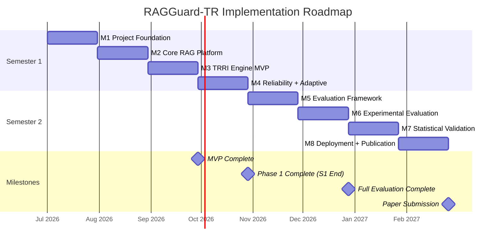

# RAGGuard-TR: Implementation Roadmap

**Document Version:** 1.0.0  
**Status:** Approved  
**Authors:** Capstone Research Team  
**Last Updated:** 2026-06-16  
**Classification:** Internal Technical Reference  

---

## Table of Contents

1. [Roadmap Overview](#1-roadmap-overview)
2. [Phase Summary](#2-phase-summary)
3. [Semester 1 — Foundation and Core Platform](#3-semester-1--foundation-and-core-platform)
   - [Month 1 — Project Foundation](#month-1--project-foundation)
   - [Month 2 — Core RAG Platform](#month-2--core-rag-platform)
   - [Month 3 — TRRI Engine MVP](#month-3--trri-engine-mvp)
   - [Month 4 — Reliability Calibration and Adaptive Retrieval](#month-4--reliability-calibration-and-adaptive-retrieval)
4. [Semester 2 — Research Validation and Publication](#4-semester-2--research-validation-and-publication)
   - [Month 5 — Evaluation Framework](#month-5--evaluation-framework)
   - [Month 6 — Experimental Evaluation](#month-6--experimental-evaluation)
   - [Month 7 — Statistical Validation and Ablation Studies](#month-7--statistical-validation-and-ablation-studies)
   - [Month 8 — Deployment and Publication Preparation](#month-8--deployment-and-publication-preparation)
5. [Engineering Effort Estimates](#5-engineering-effort-estimates)
6. [Milestone Dependency Graph](#6-milestone-dependency-graph)
7. [Risk Register and Mitigations](#7-risk-register-and-mitigations)

---

## 1. Roadmap Overview

| Period | Semester | Focus | Key Deliverable |
|--------|----------|-------|-----------------|
| Month 1 | S1 | Project Foundation | Dev environment, DB schema, CI/CD skeleton |
| Month 2 | S1 | Core RAG Platform | Working ingestion → retrieval → generation |
| Month 3 | S1 | TRRI MVP | TRRI score visible in every query response |
| Month 4 | S1 | Reliability + Adaptive | Full TRRI + adaptive retrieval + frontend |
| Month 5 | S2 | Evaluation Framework | RAGAS, DeepEval, benchmark harness |
| Month 6 | S2 | Experimental Evaluation | Full benchmark run across all 5 datasets |
| Month 7 | S2 | Statistical Validation | Ablation studies, significance testing, calibration |
| Month 8 | S2 | Deployment + Publication | AWS deployment, CI/CD, paper submission |

---

## 2. Phase Summary

| Phase | Name | Semester | Months |
|-------|------|----------|--------|
| Phase 1 | Project Foundation | S1 | M1 |
| Phase 2 | Core RAG Platform | S1 | M2 |
| Phase 3 | TRRI Development | S1 | M3 |
| Phase 4 | Reliability Calibration | S1 | M4 |
| Phase 5 | Evaluation Framework | S2 | M5 |
| Phase 6 | Experimental Evaluation | S2 | M6 |
| Phase 7 | Statistical Validation | S2 | M7 |
| Phase 8 | Deployment + Publication | S2 | M8 |

---

## 3. Semester 1 — Foundation and Core Platform

---

### Month 1 — Project Foundation

**Phase:** Phase 1 — Project Foundation

---

#### Objectives

1. Establish complete local development environment with all services running via Docker Compose
2. Implement production-grade PostgreSQL schema with all tables and indexes
3. Implement JWT authentication (register, login, refresh, logout)
4. Establish GitHub repository structure, CI pipeline skeleton, and coding standards
5. Validate technology stack compatibility (Ollama + RAGAS + ChromaDB integration)

---

#### Tasks

| ID | Task | Sub-tasks | Effort | Owner |
|----|------|-----------|--------|-------|
| T1.1 | Repository Setup | Init monorepo, configure linting (Ruff, ESLint), pre-commit hooks, GitHub Actions skeleton | 4h | All |
| T1.2 | Docker Compose (Dev) | Services: postgres, redis, chromadb, ollama, api, frontend, prometheus, grafana | 8h | Backend |
| T1.3 | Database Migration Framework | Alembic setup, initial migration file with all DDL from database.md | 6h | Backend |
| T1.4 | PostgreSQL Full Schema | All 13 tables, enums, indexes, constraints from database.md | 10h | Backend |
| T1.5 | FastAPI App Factory | Application structure, middleware stack, lifespan, health endpoint | 6h | Backend |
| T1.6 | JWT Auth Implementation | Register, login, refresh, logout endpoints per TRD Section 6 | 12h | Backend |
| T1.7 | Pydantic V2 Schemas | All auth schemas, validation, error response schemas | 4h | Backend |
| T1.8 | User Repository | CRUD operations for users, refresh_tokens, profiles, settings | 4h | Backend |
| T1.9 | Logging and Error Handling | structlog setup, global exception handler, error code registry | 4h | Backend |
| T1.10 | Frontend Scaffold | Vite + React + TypeScript init, React Router, Zustand, React Query, Axios client | 8h | Frontend |
| T1.11 | Frontend Auth Pages | Login page, Register page, JWT interceptors, refresh token logic | 8h | Frontend |
| T1.12 | Stack Compatibility Test | Run Ollama, pull nomic-embed-text + llama3.1:8b, test RAGAS with Ollama wrapper | 4h | Backend |
| T1.13 | GitHub Actions CI | Lint + typecheck + unit test workflow on push to main and PRs | 4h | All |
| T1.14 | ENV Configuration | .env.example with all variables, python-dotenv + pydantic Settings | 2h | Backend |

---

#### Deliverables

- [ ] GitHub repository with documented structure, linting CI passing
- [ ] Docker Compose dev stack: all services start with `docker compose up`
- [ ] PostgreSQL schema fully migrated (all 13 tables, indexes, constraints)
- [ ] JWT authentication API: register, login, refresh, logout — manually tested via Swagger UI
- [ ] Frontend login/register pages operational
- [ ] Ollama running locally with `nomic-embed-text` and `llama3.1:8b-instruct-q4_K_M` pulled
- [ ] Stack compatibility matrix documented (RAGAS + Ollama wrapper validated)

---

#### Dependencies

- Hardware: Development machine with ≥ 6 GB VRAM GPU available
- External: HuggingFace account for dataset access
- Tooling: Docker Desktop, Python 3.11, Node.js 20

---

#### Risks

| Risk | Probability | Mitigation |
|------|-------------|------------|
| RAGAS incompatibility with Ollama wrapper | Medium | Allocate T1.12 as first priority; document workarounds in Day 1 |
| Docker Compose port conflicts on development machines | Low | Document port map in README; allow override via env |
| Ollama model pull too large for dev network | Low | Pre-download on institutional WiFi; cache in shared volume |

---

#### Testing Strategy

| Test Type | Scope | Tool |
|-----------|-------|------|
| Unit | password hashing, JWT encode/decode, Pydantic schema validation | pytest |
| Integration | Auth endpoints end-to-end (register → login → refresh → logout) | pytest + httpx |
| Manual | Docker Compose startup, Ollama model availability | Developer checklist |

---

#### Acceptance Criteria

- [ ] `docker compose up` starts all 9 services without errors
- [ ] `POST /api/v1/auth/register` + `POST /api/v1/auth/login` return 201/200 with valid JWTs
- [ ] Refresh token rotation works and old token is invalidated
- [ ] All Alembic migrations apply cleanly on fresh PostgreSQL instance
- [ ] GitHub Actions CI pipeline passes on first push
- [ ] `ollama run llama3.1:8b-instruct-q4_K_M` returns a response in < 30 seconds

---

### Month 2 — Core RAG Platform

**Phase:** Phase 2 — Core RAG Platform

---

#### Objectives

1. Implement complete document ingestion pipeline (upload → extract → chunk → embed → store)
2. Implement semantic retrieval from ChromaDB
3. Implement basic single-turn Q&A using Ollama with retrieved context
4. Build collection management API and frontend
5. Validate end-to-end: upload PDF → query → receive grounded answer

---

#### Tasks

| ID | Task | Sub-tasks | Effort | Owner |
|----|------|-----------|--------|-------|
| T2.1 | Collection CRUD API | Create, list, get, update, delete collections; TRRI defaults stored | 8h | Backend |
| T2.2 | Document Upload API | Multipart upload, file validation (type/size/hash), S3/local storage | 8h | Backend |
| T2.3 | Celery Setup | celery_app factory, worker configuration, 3 queues (ingestion/benchmark/evaluation) | 6h | Backend |
| T2.4 | PDF Extraction Worker | pdfplumber + pytesseract fallback, page map, text cleaning | 10h | Backend |
| T2.5 | DOCX/TXT/MD Extraction | python-docx and plain text extraction workers | 4h | Backend |
| T2.6 | Chunking Worker | RecursiveCharacterTextSplitter, configurable size/overlap, chunk DB insertion | 8h | Backend |
| T2.7 | Embedding Worker | Batch Ollama embedding calls, L2 normalization, retry logic | 8h | Backend |
| T2.8 | ChromaDB Storage Worker | Collection create/get, batch upsert with metadata, chunk_id cross-reference | 8h | Backend |
| T2.9 | Ingestion Status API | GET /documents/{id} returning status, chunk_count, error | 3h | Backend |
| T2.10 | Document Metadata Extraction | Title, author, document_date inference from PDF metadata + content heuristics | 6h | Backend |
| T2.11 | Retrieval Service | ChromaDB query wrapper, RetrievedChunk dataclass, metadata deserialization | 6h | Backend |
| T2.12 | Ollama Generation Service | Prompt building (system + context + query), streaming generation, token counting | 8h | Backend |
| T2.13 | Basic Chat API (non-streaming) | POST /chat, single-turn, return full answer + chunk_ids | 6h | Backend |
| T2.14 | SSE Chat API | Convert to streaming via StreamingResponse + SSE event generator | 6h | Backend |
| T2.15 | Chat Session Management | Create session, store messages, session history retrieval | 4h | Backend |
| T2.16 | Frontend: Collection Manager | List, create, view collections; document upload with progress bar | 12h | Frontend |
| T2.17 | Frontend: Basic Chat | Simple chat UI with streaming display, source citations panel | 10h | Frontend |
| T2.18 | Integration Testing | Upload 3 PDFs, query 20 questions, verify grounded answers | 6h | All |

---

#### Deliverables

- [ ] Document ingestion pipeline fully operational (PDF, DOCX, TXT, MD)
- [ ] ChromaDB stores embeddings with temporal metadata
- [ ] `POST /api/v1/chat/{id}/stream` returns SSE-streamed answers
- [ ] Frontend: upload PDF → see chunk count → query → see streamed answer with citations
- [ ] Ingestion status polling works (pending → processing → embedding → completed)
- [ ] Celery workers running in Docker Compose dev stack

---

#### Dependencies

- Phase 1 complete (auth, DB schema, Docker Compose)
- Ollama running with both models available

---

#### Risks

| Risk | Probability | Mitigation |
|------|-------------|------------|
| Document date inference unreliable for scanned PDFs | High | Use ingestion date as fallback; flag `document_date_source=inferred` |
| Ollama embedding throughput too slow for batch ingestion | Medium | Increase batch size; profile at 100-page PDF |
| ChromaDB persistent mode incompatible with Docker volume | Low | Test volume mount in Week 1 of Month 2 |

---

#### Testing Strategy

| Test Type | Scope | Tool |
|-----------|-------|------|
| Unit | PDF extractor, chunker logic, embedding normalization | pytest |
| Integration | Full ingestion pipeline: upload → completed | pytest with test PDFs |
| Integration | Retrieval: query → top-K chunks returned | pytest |
| E2E | Upload → Query → Streamed answer | Playwright |

---

#### Acceptance Criteria

- [ ] 20-page PDF ingested in < 60 seconds (local hardware)
- [ ] ChromaDB query returns top-10 chunks with correct metadata within 500ms
- [ ] SSE stream delivers first token within 5 seconds of query
- [ ] 0 ingestion failures on 10 diverse test PDFs
- [ ] Frontend shows correct ingestion status updates
- [ ] Celery task retry works on simulated embedding failure

---

### Month 3 — TRRI Engine MVP

**Phase:** Phase 3 — TRRI Development

---

#### Objectives

1. Implement all four TRRI factor calculators (TF, SC, SrC, CC)
2. Integrate TRRI computation into the SSE query pipeline (pre-generation gate)
3. Persist all TRRI results to `reliability_scores` table
4. Display TRRI scores in frontend with factor breakdown
5. Validate TRRI computation correctness against manually labelled documents

---

#### Tasks

| ID | Task | Sub-tasks | Effort | Owner |
|----|------|-----------|--------|-------|
| T3.1 | TRRI Engine Core | TRRIEngine class, TRRIResult dataclass, parallel factor computation | 6h | Backend |
| T3.2 | Temporal Freshness Calculator | Exponential decay formula, missing-date penalty, unit tests | 8h | Backend |
| T3.3 | Semantic Coherence Calculator | Pairwise cosine similarity, variance computation, coherence formula | 8h | Backend |
| T3.4 | Source Credibility Calculator | Document type credibility table, author/DOI bonuses, batch scoring | 6h | Backend |
| T3.5 | Contextual Completeness Calculator | Query decomposition heuristic, sub-query embedding, coverage computation | 10h | Backend |
| T3.6 | TRRI Aggregator | Weighted sum, threshold evaluation, adaptive_decision assignment | 4h | Backend |
| T3.7 | TRRI Integration into SSE Pipeline | Insert TRRI gate between retrieval and generation, emit SSE events | 6h | Backend |
| T3.8 | Reliability Scores Persistence | INSERT reliability_scores after each TRRI computation | 4h | Backend |
| T3.9 | TRRI API in Response Schema | Include trri_score, factors, decision in all chat response SSE events | 3h | Backend |
| T3.10 | Collection TRRI Configuration API | PATCH /collections/{id}/settings for weight and threshold updates | 4h | Backend |
| T3.11 | TRRI Validation Experiment | 50 manually labelled (document_date, expected_freshness) test cases | 6h | Research |
| T3.12 | Frontend: TRRIGauge Component | Circular gauge + 4 factor bars + risk color coding + decision badge | 10h | Frontend |
| T3.13 | Frontend: TRRI Panel Integration | Embed TRRIGauge in chat interface, real-time update from SSE | 8h | Frontend |
| T3.14 | Frontend: TRRI Settings Modal | Allow user to configure TRRI weights per collection | 6h | Frontend |
| T3.15 | Prometheus TRRI Metrics | trri_score histogram, computation latency, decision counter | 4h | Backend |
| T3.16 | TRRI Unit Test Suite | 50+ test cases covering edge cases (missing dates, single chunk, etc.) | 8h | Backend |

---

#### Deliverables

- [ ] TRRI score [0, 1] computed and returned for every query
- [ ] All four factors (TF, SC, SrC, CC) independently computable and testable
- [ ] TRRI results persisted in `reliability_scores` table with full breakdown
- [ ] Frontend displays TRRIGauge in real time during streaming
- [ ] Per-collection TRRI weight configuration operational
- [ ] 50+ unit tests with ≥ 90% line coverage of TRRI module

---

#### Dependencies

- Month 2 complete (retrieval pipeline and SSE streaming operational)
- Test document corpus available (mix of academic papers, news articles, policy docs with known dates)

---

#### Risks

| Risk | Probability | Mitigation |
|------|-------------|------------|
| Contextual Completeness query decomposition too noisy | High | Start with simple clause-split heuristic; LLM decomposition as Phase 2 upgrade |
| TRRI computation adds > 500ms latency | Medium | Profile parallelism; cache SC if chunks unchanged |
| SC metric penalizes intentionally diverse retrieval sets | Medium | Tune coherence formula; document in research paper as design choice |

---

#### Testing Strategy

| Test Type | Scope | Tool |
|-----------|-------|------|
| Unit | Each factor calculator with known inputs → expected outputs | pytest |
| Integration | Full TRRI pipeline on real queries with known document dates | pytest |
| Property | TRRI score always ∈ [0, 1] regardless of input | Hypothesis (property-based) |
| Manual | Visual inspection of TRRIGauge in browser across 20 queries | Developer review |

---

#### Acceptance Criteria

- [ ] TRRI score returned in every SSE query response
- [ ] TF score of 1.0 for today's document, ≤ 0.5 for document > 6 months old (with default 180-day half-life)
- [ ] SC score ≥ 0.8 for 5 chunks from the same document section
- [ ] SC score ≤ 0.4 for 5 manually contradictory chunks
- [ ] SrC score ≥ 0.90 for academic_paper type, ≤ 0.55 for blog_post type
- [ ] TRRI computation latency ≤ 200ms for 10-chunk retrieval set
- [ ] TRRIGauge renders correctly for PROCEED, EXPAND, and REJECT decisions

---

### Month 4 — Reliability Calibration and Adaptive Retrieval

**Phase:** Phase 4 — Reliability Calibration + Phase 5 (partial) — Adaptive Retrieval

---

#### Objectives

1. Implement three-tier adaptive retrieval decision logic
2. Implement reliability calibration metrics (ECE, reliability diagram)
3. Build experiment tracking infrastructure
4. Build reliability analytics dashboard (frontend)
5. Achieve MVP of experiment creation and basic RAGAS evaluation
6. Docker Compose production configuration complete

---

#### Tasks

| ID | Task | Sub-tasks | Effort | Owner |
|----|------|-----------|--------|-------|
| T4.1 | Adaptive Retrieval Controller | Three-tier logic (PROCEED/EXPAND/REJECT), re-ranking by freshness, Round 2 TRRI re-compute | 10h | Backend |
| T4.2 | Adaptive Decision SSE Events | Emit expand/reject SSE events before generation gate | 4h | Backend |
| T4.3 | REJECT Path Handling | Return reliability warning SSE event, persist rejected messages, no generation | 4h | Backend |
| T4.4 | Calibration Service | ECE computation, MCE, reliability diagram data, Brier score | 8h | Backend |
| T4.5 | AUC-ROC Service | sklearn roc_auc_score wrapper, binary hallucination label support | 4h | Backend |
| T4.6 | Experiment CRUD API | Create, list, get, update experiments with config JSON | 8h | Backend |
| T4.7 | Experiment Run API | POST /experiments/{id}/run dispatches Celery experiment_run task | 4h | Backend |
| T4.8 | Basic Experiment Runner | Celery task: load config, run 50 test queries, compute basic metrics | 8h | Backend |
| T4.9 | RAGAS Integration | OllamaLLMWrapper, OllamaEmbeddingWrapper, RAGAS evaluate() call | 10h | Backend |
| T4.10 | Evaluations Table Writer | INSERT INTO evaluations after RAGAS completes | 4h | Backend |
| T4.11 | Experiment Results API | GET /experiments/{id}/results returns full evaluation payload | 4h | Backend |
| T4.12 | Frontend: Experiment Dashboard | Experiment list, create modal, run button, status polling | 10h | Frontend |
| T4.13 | Frontend: Experiment Results | Metrics cards (faithfulness, context recall), TRRI distribution chart | 8h | Frontend |
| T4.14 | Frontend: Reliability Analytics | Calibration curve visualization, AUC-ROC chart, TRRI trend over time | 10h | Frontend |
| T4.15 | Frontend: Adaptive Decision UI | EXPAND banner and REJECT warning in chat interface | 6h | Frontend |
| T4.16 | Docker Compose Production | docker-compose.prod.yml, Nginx config, SSL setup, .env.prod template | 8h | Backend |
| T4.17 | Prometheus + Grafana | Prometheus scrape config, Grafana dashboard JSON (all panels from TRD) | 6h | Backend |
| T4.18 | Integration Test: Full Pipeline | 50 queries end-to-end including EXPAND and REJECT paths | 6h | All |

---

#### Deliverables

- [ ] Adaptive retrieval operational: all three decision paths tested and verified
- [ ] REJECT path returns reliability warning and no answer generated
- [ ] RAGAS evaluation runs on demand and stores results in `evaluations` table
- [ ] Calibration diagram data computed and stored per experiment
- [ ] Experiment tracking dashboard functional in frontend
- [ ] Reliability analytics page with calibration curve
- [ ] Docker Compose production stack operational locally
- [ ] Grafana dashboard displays all required panels

---

#### Dependencies

- Month 3 complete (TRRI Engine fully operational)
- Minimum 200 labelled QA pairs with ground truth answers for RAGAS evaluation

---

#### Risks

| Risk | Probability | Mitigation |
|------|-------------|------------|
| RAGAS evaluation with Ollama judge is slow (>10 min for 50 samples) | High | Batch evaluation; use async RAGAS; profile and tune |
| Insufficient labelled data for calibration at Month 4 | Medium | Use HotpotQA dev split as first labelled dataset |
| Calibration ECE misleading without balanced score distribution | Medium | Document in paper that calibration requires full experiment scale |

---

#### Testing Strategy

| Test Type | Scope | Tool |
|-----------|-------|------|
| Integration | Adaptive EXPAND: retrieve 20 chunks, verify re-ranking | pytest |
| Integration | Adaptive REJECT: low-TRRI query returns warning SSE | pytest |
| Integration | RAGAS evaluation on 20 synthetic QA pairs | pytest |
| Manual | Calibration curve visually matches reliability diagram expectations | Researcher review |

---

#### Acceptance Criteria

- [ ] EXPAND path retrieves 2× chunks and re-ranks by freshness score
- [ ] REJECT path emits reliability_warning SSE and no generation occurs
- [ ] RAGAS faithfulness computed without error on 50 QA pairs
- [ ] Calibration diagram renders correctly in frontend
- [ ] Experiment can be created, run, and results viewed entirely from frontend UI
- [ ] `docker compose -f docker-compose.prod.yml up` starts cleanly

---

## 4. Semester 2 — Research Validation and Publication

---

### Month 5 — Evaluation Framework

**Phase:** Phase 5 — Full Evaluation Framework + Benchmark Infrastructure

---

#### Objectives

1. Implement complete benchmark execution pipeline for all 5 datasets
2. Implement all 4 baseline RAG systems (Naive, Self-RAG, CRAG, Adaptive-RAG)
3. Implement DeepEval metrics integration
4. Implement statistics service (Wilcoxon, t-test, McNemar, Cohen's d)
5. Implement ablation study infrastructure
6. Validate benchmark harness on HotpotQA (100-sample smoke test)

---

#### Tasks

| ID | Task | Sub-tasks | Effort | Owner |
|----|------|-----------|--------|-------|
| T5.1 | HotpotQA Dataset Loader | HuggingFace datasets load, parse, schema normalize, pin version | 6h | Backend |
| T5.2 | Natural Questions Loader | NQ dataset load and normalize | 4h | Backend |
| T5.3 | TriviaQA Loader | TriviaQA load and normalize | 4h | Backend |
| T5.4 | TimeQA Loader | TimeQA temporal Q&A dataset load | 6h | Backend |
| T5.5 | ChronoQA Loader | ChronoQA load or construction from temporal subset | 8h | Research |
| T5.6 | Dataset Ingestion Pipeline | Auto-ingest benchmark corpus into ChromaDB per dataset | 10h | Backend |
| T5.7 | Benchmark Execution Celery Task | Per-dataset per-strategy execution loop (Section 15 workflow) | 12h | Backend |
| T5.8 | Naive RAG Strategy | Top-K retrieval only, no TRRI, no adaptive logic | 4h | Backend |
| T5.9 | Self-RAG Strategy | Implement self-reflection token logic per paper | 12h | Backend |
| T5.10 | CRAG Strategy | Corrective retrieval with web-search fallback stub | 10h | Backend |
| T5.11 | Adaptive-RAG Strategy | Query complexity routing (simple/complex/multi-hop) | 10h | Backend |
| T5.12 | Strategy Factory | Pluggable strategy pattern; strategy loaded from experiment config | 4h | Backend |
| T5.13 | DeepEval Integration | Hallucination metric, answer correctness metric | 8h | Backend |
| T5.14 | Statistics Service | Wilcoxon signed-rank, paired t-test, McNemar, Cohen's d | 8h | Backend |
| T5.15 | Ablation Study Task | Celery task: zero-out one factor, re-run N samples, store results | 10h | Backend |
| T5.16 | Ablation API | POST /experiments/{id}/ablation with factor configuration | 4h | Backend |
| T5.17 | Benchmark Results API | Full result payload with per-question breakdown | 4h | Backend |
| T5.18 | Frontend: Benchmark Run UI | Dataset selector, strategy selector, run button, progress bar | 10h | Frontend |
| T5.19 | Frontend: Comparison Table | Side-by-side metrics: RAGGuard-TR vs baselines | 8h | Frontend |
| T5.20 | Frontend: Ablation Chart | Bar chart of factor contribution (delta faithfulness per factor) | 6h | Frontend |
| T5.21 | Smoke Test: HotpotQA 100 | Full pipeline: RAGGuard-TR vs Naive RAG on 100 HotpotQA samples | 8h | All |

---

#### Deliverables

- [ ] All 5 dataset loaders operational and pinned to specific versions
- [ ] Benchmark corpus ingested into ChromaDB for HotpotQA (full dataset)
- [ ] All 4 baseline strategies implemented as pluggable RetrievalStrategy subclasses
- [ ] Ablation study pipeline operational
- [ ] Statistics service computes significance tests automatically
- [ ] Smoke test results: RAGGuard-TR faithfulness vs Naive RAG on HotpotQA (100 samples) documented

---

#### Dependencies

- Semester 1 complete (all 4 months)
- GPU compute available for full-scale benchmark runs
- Research literature reviewed for Self-RAG and CRAG implementations

---

#### Risks

| Risk | Probability | Mitigation |
|------|-------------|------------|
| Self-RAG requires fine-tuned model (self-reflection tokens) | High | Use inference-time prompting approach as approximation; document difference in paper |
| ChronoQA not publicly available | Medium | Construct temporal Q&A subset from TimeQA with time-anchored questions |
| Dataset corpus ingestion too slow (millions of passages) | High | Batch embed via multiprocessing; use async Ollama calls with connection pool |

---

#### Testing Strategy

| Test Type | Scope | Tool |
|-----------|-------|------|
| Unit | All dataset loaders: verify schema, types, no null question/answer | pytest |
| Integration | Smoke test: 10 samples each strategy → results table non-empty | pytest |
| Statistical | Wilcoxon test on synthetic data with known p-values | pytest |
| Performance | 100-sample benchmark run time < 2 hours on dev hardware | Timer assertion |

---

#### Acceptance Criteria

- [ ] All 5 datasets load without error with correct schema
- [ ] Benchmark run completes for HotpotQA (100 samples, RAGGuard-TR) in < 2 hours
- [ ] All 4 baseline strategies return answers for > 95% of test questions
- [ ] Ablation study produces delta_faithfulness for each of 4 factors
- [ ] Wilcoxon test correctly rejects null hypothesis on synthetic (significantly different) score sets
- [ ] Comparison table renders in frontend with all 5 strategy columns

---

### Month 6 — Experimental Evaluation

**Phase:** Phase 6 — Experimental Evaluation

---

#### Objectives

1. Execute full benchmark suite: all 5 datasets × all 5 strategies (RAGGuard-TR + 4 baselines)
2. Compute RAGAS metrics, DeepEval metrics, TRRI calibration for all runs
3. Validate RQ1 (TRRI–hallucination correlation)
4. Validate RQ2 (temporal freshness influence)
5. Produce first set of results tables suitable for paper inclusion

---

#### Tasks

| ID | Task | Sub-tasks | Effort | Owner |
|----|------|-----------|--------|-------|
| T6.1 | HotpotQA Full Benchmark | RAGGuard-TR + 4 baselines × 500 samples; 5 experiment runs | 20h (compute) | Backend |
| T6.2 | Natural Questions Full Benchmark | Same setup, 500 samples | 20h (compute) | Backend |
| T6.3 | TriviaQA Full Benchmark | Same setup, 500 samples | 20h (compute) | Backend |
| T6.4 | TimeQA Full Benchmark | Same setup, 500 samples | 20h (compute) | Backend |
| T6.5 | ChronoQA Full Benchmark | Same setup, 500 samples | 20h (compute) | Backend |
| T6.6 | Hallucination Labelling | Manually label 200 QA pairs as hallucinated/faithful (stratified by TRRI) | 16h | Research |
| T6.7 | TRRI Correlation Analysis | Pearson r, Spearman ρ, scatter plot of TRRI vs faithfulness | 8h | Research |
| T6.8 | Temporal Influence Analysis | Compare TRRI TF factor vs faithfulness on TimeQA/ChronoQA specifically | 6h | Research |
| T6.9 | Cross-Dataset Generalization | Train hallucination predictor on HotpotQA, test on NQ/TriviaQA | 8h | Research |
| T6.10 | Results Tables Generation | LaTeX tables: faithfulness, context recall, TRRI scores per dataset per strategy | 8h | Research |
| T6.11 | Reliability Diagram Generation | Plot calibration curves for all 5 datasets | 4h | Research |
| T6.12 | Adaptive Decision Analysis | Distribution of PROCEED/EXPAND/REJECT across datasets | 4h | Research |
| T6.13 | Error Analysis | Manual review of 50 hallucinated answers; identify failure patterns | 8h | Research |
| T6.14 | Experiment IDs Documentation | Map experiment IDs to paper Table/Figure numbers | 2h | Research |
| T6.15 | Results Backup | Export all experiment results to CSV + JSON; upload to S3 | 2h | Backend |

---

#### Deliverables

- [ ] Full benchmark results for all 25 runs (5 datasets × 5 strategies) stored in DB
- [ ] RAGAS + DeepEval + TRRI calibration computed for all runs
- [ ] TRRI–faithfulness Pearson r computed and statistical significance confirmed
- [ ] Cross-dataset generalization AUC computed
- [ ] First draft results tables (LaTeX format) ready for paper
- [ ] Calibration curves generated for all 5 datasets
- [ ] All experiment results backed up

---

#### Dependencies

- Month 5 complete (all dataset loaders, all strategy implementations, full evaluation pipeline)
- GPU compute for full benchmark runs (AWS g4dn.xlarge or local equivalent)
- 16 hours of researcher time for manual hallucination labelling

---

#### Risks

| Risk | Probability | Mitigation |
|------|-------------|------------|
| Benchmark runs take > 8 hours per run | High | Use AWS spot instances; run 5 strategies concurrently on separate workers |
| Manual hallucination labelling has low inter-rater agreement | Medium | Two researchers label 50 overlapping samples; compute Cohen's Kappa |
| TRRI–hallucination correlation below r=0.60 | Medium | Investigate which factor drives correlation; re-scope RQ hypothesis as exploratory |
| API rate limits on Ollama (single instance bottleneck) | High | Use separate Ollama instances for generation vs judge |

---

#### Acceptance Criteria

- [ ] All 25 benchmark runs complete without error (> 95% question completion rate per run)
- [ ] RAGAS faithfulness computed for all runs
- [ ] TRRI correlation analysis yields r ≥ 0.55 (minimum for hypothesis support)
- [ ] ECE ≤ 0.10 on at least 3 of 5 datasets
- [ ] Results tables drafted with sufficient data for all key claims in abstract

---

### Month 7 — Statistical Validation and Ablation Studies

**Phase:** Phase 7 — Statistical Validation (aligned with publication requirements)

---

#### Objectives

1. Execute complete ablation studies for all 4 TRRI factors
2. Compute statistical significance tests for all pairwise comparisons
3. Validate RQ3 (factor contribution), RQ4 (adaptive retrieval improvement), RQ5 (generalization)
4. Address reviewer-level rigor: effect sizes, confidence intervals, multiple testing correction
5. Draft paper Sections 4 (Methodology) and 5 (Experiments and Results)

---

#### Tasks

| ID | Task | Sub-tasks | Effort | Owner |
|----|------|-----------|--------|-------|
| T7.1 | Ablation: TF Disabled | Zero-out temporal_freshness, re-run all 5 datasets × 100 samples | 12h (compute) | Backend |
| T7.2 | Ablation: SC Disabled | Zero-out semantic_coherence, re-run all 5 datasets × 100 samples | 12h (compute) | Backend |
| T7.3 | Ablation: SrC Disabled | Zero-out source_credibility, re-run all 5 datasets × 100 samples | 12h (compute) | Backend |
| T7.4 | Ablation: CC Disabled | Zero-out contextual_completeness, re-run all 5 datasets × 100 samples | 12h (compute) | Backend |
| T7.5 | Ablation: No TRRI (Adaptive Off) | Run RAGGuard-TR without adaptive retrieval logic | 12h (compute) | Backend |
| T7.6 | Factor Contribution Analysis | Bar chart of delta_faithfulness per factor; narrative interpretation | 8h | Research |
| T7.7 | Wilcoxon Tests: All Pairs | RAGGuard-TR vs each baseline, per dataset; 20 comparisons | 4h | Research |
| T7.8 | Bonferroni Correction | Apply multiple comparison correction to all p-values | 2h | Research |
| T7.9 | Effect Size Reporting | Cohen's d for all pairwise comparisons | 4h | Research |
| T7.10 | Confidence Intervals | Bootstrap 95% CI for faithfulness, ECE, AUC-ROC | 6h | Research |
| T7.11 | Temporal Factor Study | Isolate TF effect on TimeQA vs NQ (temporal vs non-temporal) | 6h | Research |
| T7.12 | Generalization Study | Train calibration curve on HotpotQA; evaluate on NQ, TimeQA | 4h | Research |
| T7.13 | Sensitivity Analysis | Test TRRI weight variations: {0.25,0.30,0.40} for TF | 4h | Backend |
| T7.14 | Paper Draft: Section 4 | Write Methodology: TRRI definition, factor formulae, adaptive logic | 20h | Research |
| T7.15 | Paper Draft: Section 5 | Write Experiments: setup, results tables, figures, statistical results | 20h | Research |
| T7.16 | Figures: All Paper Diagrams | TRRI architecture figure, calibration curves, ablation bar chart | 8h | Research |
| T7.17 | Reproducibility Package | Package all experiment configs, random seeds, dataset versions | 4h | Backend |

---

#### Deliverables

- [ ] All 5 ablation study runs complete with stored results
- [ ] Ablation bar chart showing delta_faithfulness per factor
- [ ] Wilcoxon p-values with Bonferroni correction for all comparisons
- [ ] Effect sizes and 95% confidence intervals for all key metrics
- [ ] Temporal factor confirmed as ≥ 30% contributor on TimeQA/ChronoQA (or null result documented)
- [ ] Cross-dataset generalization AUC ≥ 0.75 (or refined hypothesis)
- [ ] Paper Sections 4 and 5 drafted
- [ ] Reproducibility package (code + configs + seeds) validated

---

#### Acceptance Criteria

- [ ] All ablation studies run without error
- [ ] At least one ablation factor shows statistically significant delta_faithfulness (p < 0.05, Cohen's d ≥ 0.2)
- [ ] Temporal factor delta on TimeQA/ChronoQA ≥ delta on NQ/TriviaQA
- [ ] Paper sections 4 and 5 reviewed and signed off by supervisor
- [ ] Reproducibility package: another team member can re-run any experiment from config alone

---

### Month 8 — Deployment and Publication Preparation

**Phase:** Phase 8 — Deployment + Publication Preparation

---

#### Objectives

1. Deploy complete RAGGuard-TR system to AWS EC2 with Docker Compose
2. Set up GitHub Actions CI/CD pipeline for automated deployment
3. Complete all paper sections (Abstract, Introduction, Related Work, Conclusion)
4. Prepare camera-ready figures and tables
5. Submit paper to target IEEE venue
6. Final supervisor review and project sign-off

---

#### Tasks

| ID | Task | Sub-tasks | Effort | Owner |
|----|------|-----------|--------|-------|
| T8.1 | AWS EC2 Provisioning | Launch g4dn.xlarge, configure VPC/SG, allocate EIP, format EBS | 4h | Backend |
| T8.2 | Docker Compose Production Deploy | Configure docker-compose.prod.yml, copy .env.prod, bring up all services | 6h | Backend |
| T8.3 | SSL/TLS Configuration | Obtain cert (Let's Encrypt), configure Nginx HTTPS termination | 4h | Backend |
| T8.4 | Ollama on EC2 | Install Ollama, pull models, configure GPU access in Docker | 4h | Backend |
| T8.5 | Database Production Init | Run Alembic migrations on production PostgreSQL, seed admin user | 2h | Backend |
| T8.6 | Smoke Test Production | Upload test document, run 10 queries, verify TRRI and SSE on production | 4h | All |
| T8.7 | GitHub Actions: Full CI/CD | Build + push ECR → SSH deploy to EC2 on merge to main | 8h | Backend |
| T8.8 | Load Testing | Locust: 50 concurrent users, verify P95 latency targets | 4h | Backend |
| T8.9 | Grafana Production Dashboard | Configure alerts for error rate > 1%, latency > 5s | 4h | Backend |
| T8.10 | Paper: Abstract | Final abstract with all key results (max 250 words, IEEE format) | 4h | Research |
| T8.11 | Paper: Introduction | Problem statement, contributions, paper organization (3 pages) | 10h | Research |
| T8.12 | Paper: Related Work | Self-RAG, CRAG, Adaptive-RAG, temporal RAG, calibration literature (2 pages) | 12h | Research |
| T8.13 | Paper: Conclusion + Future Work | Summary of contributions, limitations, future directions (1 page) | 4h | Research |
| T8.14 | Paper: Final Figures | High-resolution figures (TRRI architecture, calibration curves, ablation) | 6h | Research |
| T8.15 | Paper: Final Tables | IEEE-format tables for all benchmark results | 4h | Research |
| T8.16 | Paper: References | Complete BibTeX, verify all citations | 4h | Research |
| T8.17 | Supervisor Final Review | Submit complete draft for supervisor approval | 4h | All |
| T8.18 | Paper Submission | Submit to target IEEE venue (Transactions or conference) | 2h | Research |
| T8.19 | GitHub Repository Public | Clean up, write comprehensive README, attach reproducibility guide | 6h | All |
| T8.20 | Project Documentation Final | Ensure all 6 docs are current and accurate | 4h | All |
| T8.21 | Final Presentation | Prepare slides for capstone defense / project evaluation | 8h | All |

---

#### Deliverables

- [ ] RAGGuard-TR running on AWS EC2 with HTTPS
- [ ] GitHub Actions CI/CD pipeline deploys on push to main
- [ ] Load test passes: P95 latency ≤ 5s at 50 concurrent users
- [ ] Complete IEEE-format paper submitted to target venue
- [ ] Public GitHub repository with README, reproducibility guide, experiment configs
- [ ] Final capstone presentation delivered
- [ ] All 6 documentation files updated to reflect final implementation

---

#### Acceptance Criteria

- [ ] Production deployment accessible via HTTPS from public internet
- [ ] All 9 Docker services running healthy in production (`/health` returns 200)
- [ ] CI/CD pipeline deploys successfully on a test push
- [ ] Paper passes plagiarism check (< 10% similarity)
- [ ] Paper reviewed and approved by supervisor
- [ ] Capstone defense pass with documented examiner feedback

---

## 5. Engineering Effort Estimates

### Semester 1

| Month | Backend (hrs) | Frontend (hrs) | Research (hrs) | Total |
|-------|--------------|----------------|----------------|-------|
| M1 | 50 | 16 | 0 | **66h** |
| M2 | 72 | 22 | 6 | **100h** |
| M3 | 58 | 24 | 6 | **88h** |
| M4 | 62 | 40 | 4 | **106h** |
| **S1 Total** | **242h** | **102h** | **16h** | **360h** |

### Semester 2

| Month | Backend (hrs) | Frontend (hrs) | Research (hrs) | Compute (hrs) | Total |
|-------|--------------|----------------|----------------|---------------|-------|
| M5 | 88 | 24 | 8 | 40 | **160h** |
| M6 | 8 | 0 | 60 | 100 | **168h** |
| M7 | 38 | 0 | 100 | 60 | **198h** |
| M8 | 46 | 0 | 54 | 0 | **100h** |
| **S2 Total** | **180h** | **24h** | **222h** | **200h** | **626h** |

> **Grand Total:** ~986 engineering-research hours over 8 months.  
> For a 2-person team, this represents approximately 123 hours/person/month (~30 hrs/week), which is appropriate for a full-time research capstone.

---

## 6. Milestone Dependency Graph



### Critical Path

```
M1 (Auth + DB + Docker)
  → M2 (Ingestion + Retrieval + Generation)
    → M3 (TRRI Engine)
      → M4 (Adaptive Retrieval + RAGAS)
        → M5 (Benchmark Harness + Baselines)
          → M6 (Full Benchmark Runs)
            → M7 (Ablation + Statistics)
              → M8 (Deployment + Paper)
```

Every month is on the critical path. No parallel tracks are available without additional team members.

---

## 7. Risk Register and Mitigations

| ID | Risk | Phase | Probability | Impact | Mitigation Strategy |
|----|------|-------|-------------|--------|---------------------|
| R1 | RAGAS/Ollama incompatibility | M1 | Medium | Critical | Test in Week 1 of M1; have DeepEval as fallback |
| R2 | Temporal metadata missing in benchmark datasets | M5 | High | High | Use document creation date; build date inference heuristic |
| R3 | Self-RAG implementation diverges from paper | M5 | High | Medium | Use inference-time prompting; document deviation in paper |
| R4 | TRRI–hallucination correlation below r=0.60 | M6 | Medium | High | Reframe as exploratory; focus on directional improvement |
| R5 | Benchmark runs > 8 hours per run | M6 | High | Medium | AWS spot instances; concurrent baseline runs |
| R6 | Statistical tests fail at p < 0.05 | M7 | Medium | High | Increase sample size to 1000; report effect sizes regardless |
| R7 | ChronoQA dataset unavailable | M5 | Medium | Medium | Construct from TimeQA temporal subset; document in paper |
| R8 | GPU out of memory during generation | M6 | Low | Medium | Use q4 quantization; reduce max_tokens; batch sequentially |
| R9 | AWS EC2 cost overrun | M8 | Medium | Low | Use spot instances; run benchmarks off-peak; terminate when idle |
| R10 | Paper rejected by target venue | M8 | Medium | Medium | Have secondary venue identified; address reviewer feedback in M8 buffer week |
| R11 | Calibration ECE above 0.05 | M7 | Medium | High | Implement Platt scaling or isotonic regression calibration layer |
| R12 | Team attrition reduces velocity | All | Low | Critical | Document all components weekly; no single point of knowledge |

---

*End of Implementation Roadmap — RAGGuard-TR v1.0.0*
